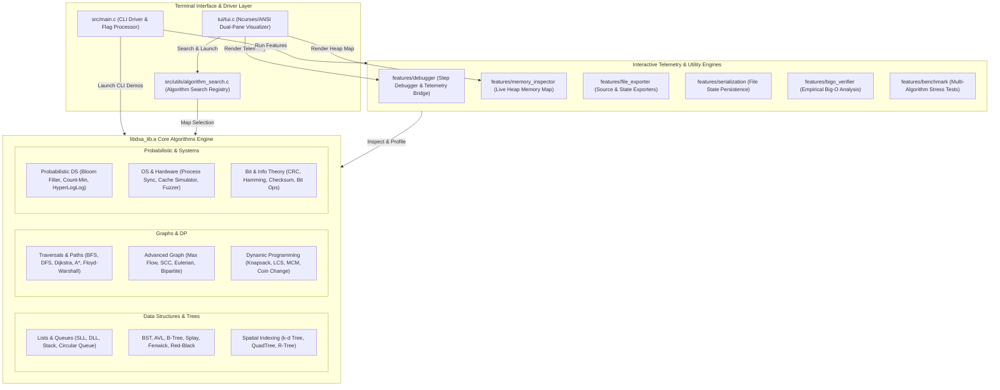

# C_DSA_interactive_suite

A modular, console-based **Data Structures & Algorithms library** written entirely in **C**, built from scratch with pointer-level control, manual memory management (`malloc` / `free`), and defensive input validation.

This project emphasizes **conceptual clarity**, **low-level fundamentals**, and **explicit memory reasoning**. It is designed with an educational intent, allowing learners to observe, experiment with, and understand data structures and algorithms step-by-step through an interactive terminal-based interface.

The codebase is structured as a reusable **DSA library**, with an interactive, console-driven **demo layer** built on top.


## Table of Contents
- [Demos](#demos)
- [Build Instructions](#build-instructions)
- [Continuous Integration](#continuous-integration)
- [Architectural Breakdown: Docker & The Build System](#architectural-breakdown-docker--the-build-system)
  - [System Architecture Overview](#system-architecture-overview)
  - [Why Docker?](#why-docker)
  - [Container Build Chain](#container-build-chain)
- [List of All Implemented Data Structures & Algorithms](#list-of-all-implemented-data-structures--algorithms)
- [License](#license)


## Demos

## Backtracking algos (Knight's tour)

[](https://asciinema.org/a/G5D8YBvcIbZM2fzF)

## Sorting algos (Bubble sort)

[](https://asciinema.org/a/J8CHAuyJAIyOduYY)

## Expression Evaluation complete

[](https://asciinema.org/a/xDm8zlxD6VzzFZFR)

## String algos (Robin Karp)

[](https://asciinema.org/a/d2BU9AVDS94GVovS)


## Build Instructions

This project includes a **Makefile** and **CMakeLists.txt** to simplify building across multiple directories.

### Requirements
- GNU Make ≥ 4.4.1
- GCC (or a compatible C compiler)

## TUI Requirements

The Text User Interface (TUI) is built using the **Ncurses** library.

### Ubuntu / Debian
```bash
sudo apt install libncurses5-dev libncursesw5-dev
```
### Fedora
```bash
sudo dnf install ncurses-devel
```
### Arch Linux
```bash
sudo pacman -S ncurses
```
> **Note:** The TUI is supported on Unix/Linux systems. On Windows, the project automatically falls back to the legacy CLI interface.

### Build (Makefile)
```bash
make
```
This generates a single executable:
* `dsa` (Linux / macOS)
* `dsa.exe` (Windows)

### Build (CMake)
Alternatively, you can compile the application and tests using CMake:
```bash
mkdir build && cd build
cmake ..
make
```

To execute all unit tests using CTest:
```bash
ctest --output-on-failure
```


```bash
make run 
```
Builds only when necessary and launches the program.


```bash
make test
```
Runs all tests and generates test binaries

```bash
make fmt
```
Organizes code style according to the standards defined in `.clang-format`

```bash
make valgrind
```
Runs Valgrind over test binaries to look for memory leaks / use after free errors


### Clean

```bash
make clean
```
Removes executables and generated object/test binaries.


## Continuous Integration

[](https://github.com/darshan2456/C_DSA_interactive_suite/actions/workflows/ci.yml)

This project includes a **GitHub Actions CI pipeline** that automatically verifies code correctness and memory safety.

On every push or pull request:

1. A fresh **Ubuntu VM** is allocated
2. The project is **compiled using GCC**
3. The `make fmt` is run on the runner and checked with your code, if they dont match, CI turns red
4. The complete **unit test suite is executed**
5. All test binaries are run under **Valgrind** to check for:
6. The project is sanitized under asan and ubsan and tests are run to check for undefined behaviour (ie semantic errors)

   - unformatted code
   - memory leaks  
   - invalid reads / writes  
   - use-after-free errors  
   - uninitialized memory usage

If any test fails or Valgrind detects a memory error, the CI job fails automatically.


## Architectural Breakdown: Docker & The Build System

### System Architecture Overview

The **C DSA Interactive Suite** is organized into a modular four-tier architecture:
- **UI & Driver Layer**: `src/main.c` (CLI prompt driver & command flag parser), `tui/tui.c` (Ncurses/ANSI dual-pane visualizer dashboard), and `src/utils/algorithm_search.c` (live search index).
- **Telemetry & Utility Layer**: Live Step-Debugger (`features/debugger/`), Memory Profiler (`features/memory_inspector/`), File & Source Exporters (`features/file_exporter/`), State Serialization (`features/serialization/`), and Big-O Verifier & Benchmark Suites (`features/bigo_verifier/`, `features/benchmark/`).
- **Core Library Engine (`libdsa_lib.a`)**: Static C library housing all dynamic data structures, standard/spatial trees, graph algorithms, dynamic programming solvers, probabilistic data structures, OS/hardware simulators, and error correction/bit operations.



### Why Docker?

Docker acts as a cross-platform wrapper around the build system. Contributors on Windows, macOS, and Linux can use the same isolated Ubuntu environment without manually configuring compiler toolchains, build dependencies, or platform-specific settings.

### Container Build Chain

The current build flow is:

```text
Docker Container
      ↓
   Makefile
      ↓
GCC Compilation
      ↓
dsa Executable
```

The Docker image installs the required build tools and executes the project's Makefile, ensuring consistent builds across different operating systems.

### Relationship Between Docker, Makefile, and CMake

Each component serves a different purpose:

- Docker provides a reproducible Linux build environment.
- The Makefile defines the primary build workflow used by the project today.
- CMakeLists.txt provides an alternative build system that can generate platform-specific build files while supporting testing and future expansion.

These tools are complementary rather than competing solutions.

### Docker Makefile Helper Commands

Helper targets have been added to the local `Makefile` to simplify building, running, and testing inside Docker:

| Command | Description |
| --- | --- |
| `make docker-test` | Builds the `dev` stage and runs the complete unit test suite inside it. |
| `make docker-run` | Builds the `runtime` stage and launches the interactive application shell. |
| `make docker-build-dev` | Builds the development stage image (`c-dsa-suite:dev`). |
| `make docker-build-runtime` | Builds the slim production stage image (`c-dsa-suite:slim`). |


### Multi-Stage Architecture

The project uses a multi-stage `Dockerfile` to separate the build environment from the lightweight runtime image:
- **Stage 1 (`dev`)**: A heavy development environment containing the full C build toolchain, `valgrind`, `gdb`, and the complete source repository.
- **Stage 2 (`runtime`)**: A minimal image packaging only the compiled binary and `libncurses6` runtime library (no source code or compiler).


## List of All Implemented Data Structures & Algorithms

This suite includes over **100+ interactive, memory-audited data structures and algorithms** organized across 21+ core module categories. Each entry is mapped to its CLI main menu option and includes time and space complexity breakdowns.

### 1. Data Structures & Core Modules (Menu Option 1)
| Data Structure / Algorithm | Category | Time Complexity (Best / Avg / Worst) | Space Complexity | Description |
| :--- | :--- | :--- | :--- | :--- |
| **Singly Linked List** | Linear Data Structures | $\mathcal{O}(1) / \mathcal{O}(N) / \mathcal{O}(N)$ | $\mathcal{O}(N)$ | Dynamic single-pointer linked nodes with traversal and insertion. |
| **Doubly Linked List** | Linear Data Structures | $\mathcal{O}(1) / \mathcal{O}(N) / \mathcal{O}(N)$ | $\mathcal{O}(N)$ | Bi-directional pointer navigation with head/tail tracking. |
| **Circular Linked List** | Linear Data Structures | $\mathcal{O}(1) / \mathcal{O}(N) / \mathcal{O}(N)$ | $\mathcal{O}(N)$ | Ring-buffer linked structure with continuous looping. |
| **Stack (Array & Linked List)** | LIFO Structure | $\mathcal{O}(1) / \mathcal{O}(1) / \mathcal{O}(1)$ | $\mathcal{O}(N)$ | Last-In-First-Out push, pop, and peek operations. |
| **Queue (Array & Linked List)** | FIFO Structure | $\mathcal{O}(1) / \mathcal{O}(1) / \mathcal{O}(1)$ | $\mathcal{O}(N)$ | First-In-First-Out enqueue and dequeue operations. |

### 2. Expression Evaluation (Menu Option 2)
| Module / Algorithm | Category | Time Complexity | Space Complexity | Description |
| :--- | :--- | :--- | :--- | :--- |
| **Infix to Postfix Conversion** | Expression Parsing | $\mathcal{O}(N)$ | $\mathcal{O}(N)$ | Converts infix arithmetic expressions using Shunting-yard algorithm. |
| **Infix to Prefix Conversion** | Expression Parsing | $\mathcal{O}(N)$ | $\mathcal{O}(N)$ | Reverses and transforms infix expressions to polish prefix notation. |
| **Postfix Expression Evaluator** | Expression Evaluation | $\mathcal{O}(N)$ | $\mathcal{O}(N)$ | Evaluates postfix token stream using operand stack. |
| **Parentheses Match Checker** | Syntax Validation | $\mathcal{O}(N)$ | $\mathcal{O}(N)$ | Validates balanced parentheses, brackets, and braces `()`, `[]`, `{}`. |

### 3. Elementary Sorting Algorithms $\mathcal{O}(N^2)$ (Menu Option 3)
| Algorithm | Category | Time Complexity (Best / Avg / Worst) | Space Complexity | Description |
| :--- | :--- | :--- | :--- | :--- |
| **Bubble Sort (Optimized)** | Elementary Sorting | $\mathcal{O}(N) / \mathcal{O}(N^2) / \mathcal{O}(N^2)$ | $\mathcal{O}(1)$ | Swaps adjacent out-of-order elements with early-exit flag. |
| **Selection Sort** | Elementary Sorting | $\mathcal{O}(N^2) / \mathcal{O}(N^2) / \mathcal{O}(N^2)$ | $\mathcal{O}(1)$ | Repeatedly finds the minimum element from unsorted subarray. |
| **Insertion Sort** | Elementary Sorting | $\mathcal{O}(N) / \mathcal{O}(N^2) / \mathcal{O}(N^2)$ | $\mathcal{O}(1)$ | Builds sorted array one item at a time by shifting elements. |
| **Shell Sort** | Elementary Sorting | $\mathcal{O}(N \log N) / \mathcal{O}(N^{1.5}) / \mathcal{O}(N^2)$ | $\mathcal{O}(1)$ | In-place comparison sort using diminishing gap increments. |

### 3. Advanced Sorting Algorithms $\mathcal{O}(N \log N)$ (Menu Option 3)
| Algorithm | Category | Time Complexity (Best / Avg / Worst) | Space Complexity | Description |
| :--- | :--- | :--- | :--- | :--- |
| **Quick Sort** | Divide & Conquer | $\mathcal{O}(N \log N) / \mathcal{O}(N \log N) / \mathcal{O}(N^2)$ | $\mathcal{O}(\log N)$ | Partitions array around a pivot element recursively. |
| **Merge Sort** | Divide & Conquer | $\mathcal{O}(N \log N) / \mathcal{O}(N \log N) / \mathcal{O}(N \log N)$ | $\mathcal{O}(N)$ | Stable divide-and-conquer sorting by merging sorted sub-arrays. |
| **Heap Sort** | Tree-based Sorting | $\mathcal{O}(N \log N) / \mathcal{O}(N \log N) / \mathcal{O}(N \log N)$ | $\mathcal{O}(1)$ | In-place comparison sort using binary max-heap heapify. |
| **Radix Sort** | Non-comparison Sort | $\mathcal{O}(N \cdot k) / \mathcal{O}(N \cdot k) / \mathcal{O}(N \cdot k)$ | $\mathcal{O}(N + k)$ | Digit-by-digit distribution sort using counting sort buckets. |
| **Bucket Sort** | Distribution Sort | $\mathcal{O}(N + k) / \mathcal{O}(N + k) / \mathcal{O}(N^2)$ | $\mathcal{O}(N)$ | Distributes elements into uniform floating-point buckets. |

### 4. Searching Algorithms (Menu Option 4)
| Algorithm | Category | Time Complexity (Best / Avg / Worst) | Space Complexity | Description |
| :--- | :--- | :--- | :--- | :--- |
| **Linear Search** | Sequential Search | $\mathcal{O}(1) / \mathcal{O}(N) / \mathcal{O}(N)$ | $\mathcal{O}(1)$ | Sequential element comparison across unsorted arrays. |
| **Binary Search (Iterative & Recursive)** | Logarithmic Search | $\mathcal{O}(1) / \mathcal{O}(\log N) / \mathcal{O}(\log N)$ | $\mathcal{O}(1)$ / $\mathcal{O}(\log N)$ | Divide-and-conquer search on sorted arrays. |
| **Jump Search** | Block Search | $\mathcal{O}(1) / \mathcal{O}(\sqrt{N}) / \mathcal{O}(\sqrt{N})$ | $\mathcal{O}(1)$ | Jumps ahead by fixed steps ($\sqrt{N}$) followed by linear search. |
| **Interpolation Search** | Position Estimator | $\mathcal{O}(1) / \mathcal{O}(\log \log N) / \mathcal{O}(N)$ | $\mathcal{O}(1)$ | Position probe search for uniformly distributed sorted arrays. |
| **Fibonacci Search** | Logarithmic Search | $\mathcal{O}(1) / \mathcal{O}(\log N) / \mathcal{O}(\log N)$ | $\mathcal{O}(1)$ | Narrows down range using Fibonacci numbers, avoiding division. |

### 5. Graph Traversals & Pathfinding (Menu Option 5)
| Algorithm | Category | Time Complexity | Space Complexity | Description |
| :--- | :--- | :--- | :--- | :--- |
| **Breadth-First Search (BFS)** | Graph Traversal | $\mathcal{O}(V + E)$ | $\mathcal{O}(V)$ | Level-order graph traversal using queue data structure. |
| **Depth-First Search (DFS)** | Graph Traversal | $\mathcal{O}(V + E)$ | $\mathcal{O}(V)$ | Deep path exploration using recursion stack. |
| **Dijkstra Shortest Path** | Single-Source Path | $\mathcal{O}((V + E) \log V)$ | $\mathcal{O}(V)$ | Shortest path algorithm for non-negative weighted graphs. |
| **A\* Search** | Heuristic Pathfinding | $\mathcal{O}(E)$ | $\mathcal{O}(V)$ | Informed pathfinding using Manhattan/Euclidean distance heuristics. |
| **Greedy Best-First Search** | Heuristic Pathfinding | $\mathcal{O}(E)$ | $\mathcal{O}(V)$ | Evaluates node distance using purely heuristic estimation. |
| **Bellman-Ford Algorithm** | Single-Source Path | $\mathcal{O}(V \cdot E)$ | $\mathcal{O}(V)$ | Handles negative weight edges and detects negative cycles. |
| **Topological Sort** | Graph Order | $\mathcal{O}(V + E)$ | $\mathcal{O}(V)$ | Linear ordering of vertices in Directed Acyclic Graphs (DAGs). |
| **Kruskal's Algorithm** | Minimum Spanning Tree | $\mathcal{O}(E \log E)$ | $\mathcal{O}(V + E)$ | MST construction using Disjoint Set Union (DSU) find-set. |
| **Prim's Algorithm** | Minimum Spanning Tree | $\mathcal{O}((V + E) \log V)$ | $\mathcal{O}(V)$ | Greedy MST growth from seed vertex using priority queue. |
| **Floyd-Warshall Algorithm** | All-Pairs Shortest Path | $\mathcal{O}(V^3)$ | $\mathcal{O}(V^2)$ | All-pairs shortest path dynamic programming matrix solver. |

### 5. Advanced Graph Algorithms (Menu Option 5)
| Algorithm | Category | Time Complexity | Space Complexity | Description |
| :--- | :--- | :--- | :--- | :--- |
| **Tarjan's SCC Algorithm** | Graph Connectivity | $\mathcal{O}(V + E)$ | $\mathcal{O}(V)$ | Strongly Connected Components using DFS lowlink values. |
| **Kosaraju's SCC Algorithm** | Graph Connectivity | $\mathcal{O}(V + E)$ | $\mathcal{O}(V)$ | Two-pass DFS strongly connected component finder. |
| **Ford-Fulkerson Algorithm** | Network Flow | $\mathcal{O}(E \cdot |f_{max}|)$ | $\mathcal{O}(V + E)$ | Augmenting path max flow calculation on residual graph. |
| **Edmonds-Karp Algorithm** | Network Flow | $\mathcal{O}(V \cdot E^2)$ | $\mathcal{O}(V + E)$ | BFS-based max flow implementation of Ford-Fulkerson. |
| **Dinic's Algorithm** | Network Flow | $\mathcal{O}(V^2 \cdot E)$ | $\mathcal{O}(V + E)$ | Level-graph blocking flow network max flow solver. |
| **Hopcroft-Karp Algorithm** | Bipartite Matching | $\mathcal{O}(E \sqrt{V})$ | $\mathcal{O}(V + E)$ | Maximum cardinality matching on bipartite graphs. |
| **Eulerian Path & Circuit** | Graph Walk | $\mathcal{O}(V + E)$ | $\mathcal{O}(V + E)$ | Validates and constructs Eulerian trails using Hierholzer's algorithm. |
| **Articulation Points Analysis** | Network Vulnerability | $\mathcal{O}(V + E)$ | $\mathcal{O}(V)$ | Identifies cut-vertices whose removal disconnects the graph. |
| **Bridges Analysis** | Network Vulnerability | $\mathcal{O}(V + E)$ | $\mathcal{O}(V)$ | Identifies critical edges whose deletion increases components. |
| **Network Vulnerability Simulator** | Network Resilience | $\mathcal{O}(V + E)$ | $\mathcal{O}(V + E)$ | Interactive resilience testing and critical failure simulation. |

### 6. Hashing & Collision Resolution (Menu Option 6)
| Hash Technique | Category | Time Complexity (Avg / Worst) | Space Complexity | Description |
| :--- | :--- | :--- | :--- | :--- |
| **Separate Chaining** | Open Hashing | $\mathcal{O}(1) / \mathcal{O}(N)$ | $\mathcal{O}(N + M)$ | Collision resolution via linked lists per table bucket. |
| **Linear Probing** | Closed Hashing | $\mathcal{O}(1) / \mathcal{O}(N)$ | $\mathcal{O}(M)$ | Open addressing with sequential index step probing. |
| **Quadratic Probing** | Closed Hashing | $\mathcal{O}(1) / \mathcal{O}(N)$ | $\mathcal{O}(M)$ | Open addressing with quadratic step $i^2$ probing. |
| **Double Hashing** | Closed Hashing | $\mathcal{O}(1) / \mathcal{O}(N)$ | $\mathcal{O}(M)$ | Open addressing using independent secondary hash function. |

### 7. Trees & Advanced Tree Structures (Menu Option 7)
| Data Structure | Category | Time Complexity (Search / Insert / Delete) | Space Complexity | Description |
| :--- | :--- | :--- | :--- | :--- |
| **Binary Search Tree (BST)** | Binary Tree | $\mathcal{O}(\log N) / \mathcal{O}(\log N) / \mathcal{O}(N)$ | $\mathcal{O}(N)$ | Standard ordered binary search tree. |
| **AVL Tree** | Self-Balancing Tree | $\mathcal{O}(\log N) / \mathcal{O}(\log N) / \mathcal{O}(\log N)$ | $\mathcal{O}(N)$ | Height-balanced binary tree using LL, RR, LR, RL rotations. |
| **Threaded Binary Tree (TBT)** | Tree Traversal | $\mathcal{O}(N) / \mathcal{O}(\log N) / \mathcal{O}(\log N)$ | $\mathcal{O}(N)$ | Fast in-order traversal using NULL pointer thread pointers. |
| **Trie (Prefix Tree)** | String Tree | $\mathcal{O}(L) / \mathcal{O}(L) / \mathcal{O}(L)$ | $\mathcal{O}(\Sigma \cdot N \cdot L)$ | Prefix search tree for string dictionaries and autocompletion. |
| **B-Tree** | Multi-Way Tree | $\mathcal{O}(\log N) / \mathcal{O}(\log N) / \mathcal{O}(\log N)$ | $\mathcal{O}(N)$ | Self-balancing $m$-way search tree for disk storage indexing. |
| **B+ Tree** | Multi-Way Tree | $\mathcal{O}(\log N) / \mathcal{O}(\log N) / \mathcal{O}(\log N)$ | $\mathcal{O}(N)$ | Sequential leaf-linked multi-way tree for range queries. |
| **Segment Tree** | Range Query Tree | $\mathcal{O}(\log N) / \mathcal{O}(\log N) / \mathcal{O}(\log N)$ | $\mathcal{O}(N)$ | Binary tree for range minimum, maximum, and sum queries. |
| **Fenwick Tree (BIT)** | Range Query Tree | $\mathcal{O}(\log N) / \mathcal{O}(\log N) / \mathcal{O}(\log N)$ | $\mathcal{O}(N)$ | Compact binary indexed tree for dynamic prefix sums. |
| **Splay Tree** | Self-Adjusting Tree | $\mathcal{O}(\log N) / \mathcal{O}(\log N) / \mathcal{O}(\log N)$ | $\mathcal{O}(N)$ | Amortized self-adjusting search tree moving recent nodes to root. |
| **Red-Black Tree** | Self-Balancing Tree | $\mathcal{O}(\log N) / \mathcal{O}(\log N) / \mathcal{O}(\log N)$ | $\mathcal{O}(N)$ | Color-balanced binary search tree using black-height invariant. |

### 8. Error Correction & Integrity Algorithms (Menu Option 8)
| Algorithm | Category | Time Complexity | Space Complexity | Description |
| :--- | :--- | :--- | :--- | :--- |
| **Checksum Validation** | Data Integrity | $\mathcal{O}(N)$ | $\mathcal{O}(1)$ | Simple additive sum verification across byte streams. |
| **Cyclic Redundancy Check (CRC-32)** | Error Detection | $\mathcal{O}(N)$ | $\mathcal{O}(1)$ | Polynomial division remainder calculation for burst errors. |
| **Hamming Code (7,4)** | Error Correction | $\mathcal{O}(N)$ | $\mathcal{O}(N)$ | Single-error correction and double-error detection (SEC-DED). |
| **Vertical Redundancy Check (VRC)** | Error Detection | $\mathcal{O}(N)$ | $\mathcal{O}(1)$ | Single parity bit verification per character. |
| **Longitudinal Redundancy Check (LRC)** | Error Detection | $\mathcal{O}(N)$ | $\mathcal{O}(1)$ | Block parity bit calculation across character streams. |

### 9. Process Synchronization Simulators (Menu Option 9)
| Simulator / Problem | Category | Complexity | Description |
| :--- | :--- | :--- | :--- |
| **Peterson's Algorithm** | Concurrency | $\mathcal{O}(1)$ per step | 2-process mutual exclusion with flags and turn variables. |
| **Dining Philosophers Problem** | Deadlock Simulation | $\mathcal{O}(N)$ threads | Simulates resource contention, circular wait, and asymmetric fixes. |
| **Readers-Writers Problem** | Semaphore Sync | $\mathcal{O}(1)$ per access | Priority reader/writer access control via semaphores. |
| **Producer-Consumer Problem** | Bounded Buffer | $\mathcal{O}(1)$ per item | Bounded buffer synchronization with mutexes and condition variables. |

### 10. CPU & Job Scheduling Algorithms (Menu Option 9)
| Scheduling Policy | Category | Preemptive | Complexity | Description |
| :--- | :--- | :--- | :--- | :--- |
| **First-Come First-Served (FCFS)** | CPU Scheduling | No | $\mathcal{O}(N \log N)$ | Non-preemptive arrival order job execution. |
| **Shortest Job First (SJF)** | CPU Scheduling | No | $\mathcal{O}(N \log N)$ | Non-preemptive shortest burst time job scheduling. |
| **Shortest Remaining Time First (SRTF)** | CPU Scheduling | Yes | $\mathcal{O}(N \log N)$ | Preemptive shortest remaining burst time scheduling. |
| **Priority Scheduling** | CPU Scheduling | No | $\mathcal{O}(N \log N)$ | Non-preemptive priority-rank based process execution. |
| **Preemptive Priority Scheduling** | CPU Scheduling | Yes | $\mathcal{O}(N \log N)$ | Preemptive higher-priority job execution. |
| **Round Robin (RR)** | CPU Scheduling | Yes | $\mathcal{O}(N)$ | Preemptive time-slice quantum round-robin scheduler. |

### 11. Backtracking Algorithms (Menu Option 10)
| Algorithm / Problem | Category | Time Complexity | Space Complexity | Description |
| :--- | :--- | :--- | :--- | :--- |
| **Knight's Tour Problem** | Backtracking | $\mathcal{O}(8^{N^2})$ | $\mathcal{O}(N^2)$ | Warnsdorff's heuristic knight's tour board traversal. |
| **N-Queens Problem** | Backtracking | $\mathcal{O}(N!)$ | $\mathcal{O}(N)$ | Places $N$ non-attacking queens on $N \times N$ chessboard. |
| **Sudoku Solver** | Backtracking | $\mathcal{O}(9^{D})$ | $\mathcal{O}(D)$ | Backtracking constraint satisfaction 9x9 grid solver. |
| **Subset Sum Problem** | Backtracking | $\mathcal{O}(2^N)$ | $\mathcal{O}(N)$ | Finds subsets matching target sum using pruning. |
| **Rat in a Maze** | Backtracking | $\mathcal{O}(2^{N^2})$ | $\mathcal{O}(N^2)$ | Grid maze pathfinding from source to destination. |

### 12. Dynamic Programming (Menu Option 11)
| Algorithm / Problem | Category | Time Complexity | Space Complexity | Description |
| :--- | :--- | :--- | :--- | :--- |
| **0/1 Knapsack Problem** | Optimization DP | $\mathcal{O}(N \cdot W)$ | $\mathcal{O}(N \cdot W)$ | Maximizes item values under capacity constraint $W$. |
| **Longest Common Subsequence (LCS)** | String DP | $\mathcal{O}(M \cdot N)$ | $\mathcal{O}(M \cdot N)$ | Computes longest common subsequence between two strings. |
| **Fibonacci Sequence (DP)** | Recurrence DP | $\mathcal{O}(N)$ | $\mathcal{O}(1)$ | Memoization & tabulation approach to Fibonacci numbers. |
| **Matrix Chain Multiplication (MCM)** | Matrix DP | $\mathcal{O}(N^3)$ | $\mathcal{O}(N^2)$ | Optimal parenthesization for minimal scalar matrix operations. |
| **Edit Distance (Levenshtein)** | String DP | $\mathcal{O}(M \cdot N)$ | $\mathcal{O}(M \cdot N)$ | Minimum insertion, deletion, and replacement operations. |
| **Coin Change Problem** | Optimization DP | $\mathcal{O}(N \cdot A)$ | $\mathcal{O}(A)$ | Minimum coins needed to make target amount $A$. |

### 13. String Processing & Compression Algorithms (Menu Option 12)
| Algorithm | Category | Time Complexity | Space Complexity | Description |
| :--- | :--- | :--- | :--- | :--- |
| **Huffman Coding** | Lossless Compression | $\mathcal{O}(N \log K)$ | $\mathcal{O}(K)$ | Prefix-free variable-length entropy encoding. |
| **Run-Length Encoding (RLE)** | Lossless Compression | $\mathcal{O}(N)$ | $\mathcal{O}(N)$ | Replaces consecutive repeated characters with run counts. |
| **LZW Compression** | Dictionary Compression | $\mathcal{O}(N)$ | $\mathcal{O}(D)$ | Dictionary-based string substitution algorithm. |
| **Burrows-Wheeler Transform (BWT)** | Block Compression | $\mathcal{O}(N \log N)$ | $\mathcal{O}(N)$ | Permutes character positions to create long runs of repeated bytes. |
| **Knuth-Morris-Pratt (KMP)** | Pattern Matching | $\mathcal{O}(N + M)$ | $\mathcal{O}(M)$ | String search using partial match failure function table. |
| **Rabin-Karp Algorithm** | Pattern Matching | $\mathcal{O}(N + M)$ | $\mathcal{O}(1)$ | Rolling hash string search supporting multi-pattern lookup. |

### 14. Advanced Heaps & Priority Queues (Menu Option 13)
| Heap Structure | Category | Time Complexity (Push / Pop / Meld) | Space Complexity | Description |
| :--- | :--- | :--- | :--- | :--- |
| **Binomial Heap** | Priority Queue | $\mathcal{O}(1) / \mathcal{O}(\log N) / \mathcal{O}(\log N)$ | $\mathcal{O}(N)$ | Collection of binomial trees supporting fast heap merges. |
| **Fibonacci Heap** | Priority Queue | $\mathcal{O}(1) / \mathcal{O}(\log N) / \mathcal{O}(1)$ | $\mathcal{O}(N)$ | Amortized priority queue for fast decrease-key operations. |
| **Leftist Heap** | Priority Queue | $\mathcal{O}(\log N) / \mathcal{O}(\log N) / \mathcal{O}(\log N)$ | $\mathcal{O}(N)$ | Meldable priority queue maintaining null path length invariant. |
| **Skew Heap** | Priority Queue | $\mathcal{O}(\log N) / \mathcal{O}(\log N) / \mathcal{O}(\log N)$ | $\mathcal{O}(N)$ | Self-adjusting meldable heap without structural balance condition. |
| **Min-Max Heap** | Double-Ended PQ | $\mathcal{O}(\log N) / \mathcal{O}(\log N) / \mathcal{O}(\log N)$ | $\mathcal{O}(N)$ | Double-ended priority queue supporting min and max queries. |
| **d-Ary Heap** | Priority Queue | $\mathcal{O}(\log_d N) / \mathcal{O}(d \log_d N) / \mathcal{O}(N)$ | $\mathcal{O}(N)$ | Multi-way branching tree generalization of binary heaps. |
| **Treap** | Randomized Search | $\mathcal{O}(\log N) / \mathcal{O}(\log N) / \mathcal{O}(\log N)$ | $\mathcal{O}(N)$ | Randomized combination of Binary Search Tree and Heap. |

### 15. Bit Manipulation & Bitwise Operations (Menu Option 14)
| Bitwise Feature | Category | Time Complexity | Description |
| :--- | :--- | :--- | :--- |
| **Basic Bitwise Operations** | Bit Operations | $\mathcal{O}(1)$ | Set, clear, toggle, and test individual bit positions. |
| **Advanced Bit Manipulation** | Bit Operations | $\mathcal{O}(1)$ | Count set bits (popcount), power of 2 check, and bit reversal. |
| **Bitwise Applications** | Bit Operations | $\mathcal{O}(1)$ | Single number finder, subset generation, and XOR tricks. |
| **Interactive Bit Visualizer** | Bit Visualization | $\mathcal{O}(1)$ | Step-by-step 32-bit register bitwise visualizer. |

### 16. Probabilistic Data Structures (Menu Option 15)
| Data Structure | Category | Time Complexity | Space Complexity | Description |
| :--- | :--- | :--- | :--- | :--- |
| **Bloom Filter** | Membership Estimator | $\mathcal{O}(k)$ | $\mathcal{O}(m)$ | Space-efficient set membership test with configurable false positive rate. |
| **Count-Min Sketch** | Frequency Estimator | $\mathcal{O}(k)$ | $\mathcal{O}(w \cdot d)$ | Sub-linear memory stream frequency estimation matrix. |
| **HyperLogLog (HLL)** | Cardinality Estimator | $\mathcal{O}(1)$ | $\mathcal{O}(\log \log N)$ | Estimates unique element counts using harmonic mean of zero-runs. |

### 17. Spatial & Multi-Dimensional Indexing (Menu Option 16)
| Index Structure | Category | Time Complexity (Search / Insert) | Space Complexity | Description |
| :--- | :--- | :--- | :--- | :--- |
| **k-d Tree** | Spatial Indexing | $\mathcal{O}(\log N) / \mathcal{O}(\log N)$ | $\mathcal{O}(N)$ | $k$-dimensional point search tree for nearest-neighbor queries. |
| **QuadTree** | Spatial Partitioning | $\mathcal{O}(\log N) / \mathcal{O}(\log N)$ | $\mathcal{O}(N)$ | 2D space recursive quadrant partitioning tree. |
| **R-Tree** | Bounding Box Index | $\mathcal{O}(\log_M N) / \mathcal{O}(\log_M N)$ | $\mathcal{O}(N)$ | Minimum Bounding Rectangle (MBR) spatial indexing. |

### 18. Cache Simulator & Eviction Policies (Menu Option 18)
| Eviction Policy | Category | Time Complexity | Description |
| :--- | :--- | :--- | :--- |
| **Least Recently Used (LRU)** | Cache Replacement | $\mathcal{O}(1)$ | Evicts page with oldest access timestamp. |
| **Least Frequently Used (LFU)** | Cache Replacement | $\mathcal{O}(1)$ | Evicts page with lowest cumulative hit frequency. |
| **First-In First-Out (FIFO)** | Cache Replacement | $\mathcal{O}(1)$ | Evicts oldest inserted page in insertion order. |
| **CLOCK (Second-Chance)** | Cache Replacement | $\mathcal{O}(1)$ avg | Circular buffer pointer approximation of LRU using reference bits. |
| **Optimal (Belady's OPT)** | Theoretical Limit | $\mathcal{O}(N)$ | Evicts page that will not be used for longest time in future. |

### 19. System Utilities & Algorithm Finder (Menu Options 17, 19)
| Utility Feature | Category | Description |
| :--- | :--- | :--- |
| **Sorting Telemetry Dashboard** | Performance Audit | Real-time comparative execution metrics, comparison counters, and swap timers. |
| **Memory Inspector & Profiler** | Memory Audit | Dynamic heap allocation tracking, pointer inspection, and leak detection. |
| **State Serialization Engine** | Persistence | Binary payload serialization & deserialization for BST, AVL, and Graph structures. |
| **Interactive Algorithm Finder** | Quick Search | Fast case-insensitive keyword search engine mapping all suite algorithms. |

---

## License
This project is licensed under the MIT License - see the LICENSE file for details.

## Author

**Darshan Parekh** and many contributors....

Aspiring systems engineer and cybersecurity engineer
