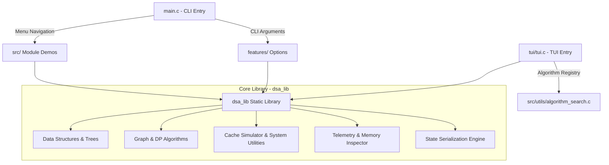

# C DSA Interactive Suite - System Architecture

## Overview

The **C DSA Interactive Suite** is structured as a modular binary suite divided into three primary layers:
1. **Core Library (`dsa_lib`)**: Pure C implementations of Data Structures, Algorithms, Benchmarks, Features (Memory Inspector, Telemetry, Serialization, Big-O Verifier), and Utilities.
2. **Main CLI Application (`src/main.c`)**: Interactive menu system, arguments parser (`--profile`, `--load-bst`, `--export-trace`), and interactive prompt loop.
3. **Terminal UI Renderer (`tui/tui.c`)**: Advanced Ncurses/ANSI terminal visualizer and algorithm registry interface.

---

## Architectural Component Diagram

---

## High-Level Data Flow

1. **User Input / Command Invocation**:
   - The user launches the executable (`dsa`) directly or passes flags (`--profile`, `--load-bst <file>`).
   - `src/main.c` initializes memory profile tracking (via `memory_tracker`) and execution telemetry if flags are provided.

2. **Algorithm Execution & Debugging**:
   - Modules execute interactive workflows calling helper subroutines in `src/utils/safe_input_*.c`.
   - Stepping algorithms trigger `algorithm_step_hook(msg)` to stream execution messages to the Step Debugger and Telemetry Exporters.

3. **TUI & Algorithm Registry Alignment**:
   - The TUI registry (`tui/tui.c`) and CLI menu finder (`src/utils/algorithm_search.c`) index all 21 categories to ensure total feature parity across both user interfaces.
